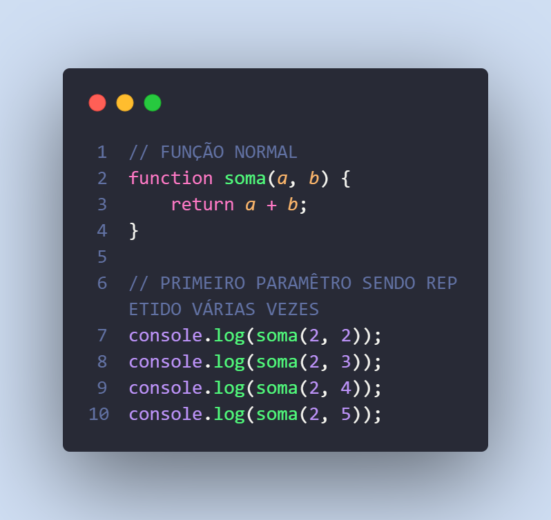
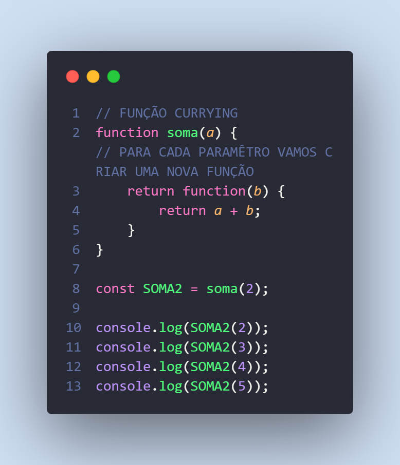
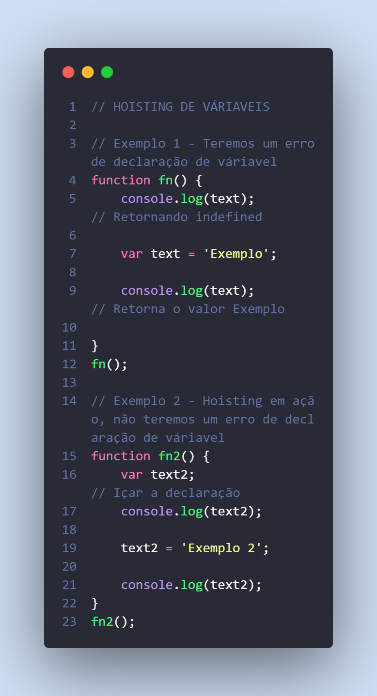
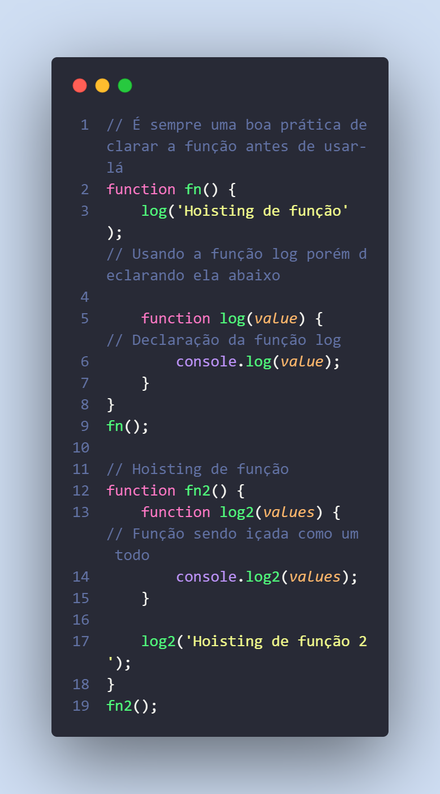
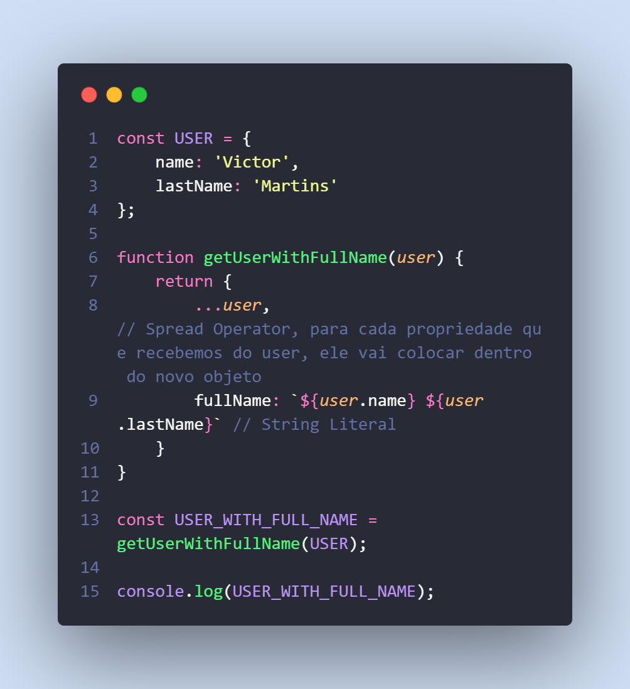
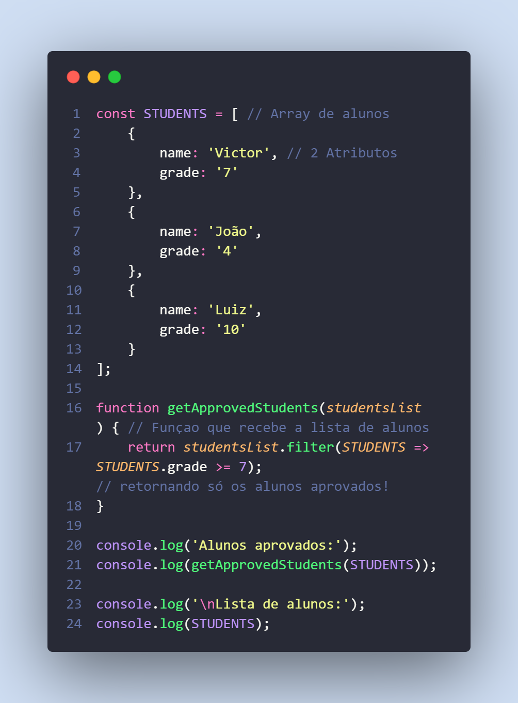

# Introdução ao ES6

## Currying, Hoisting, Imutabilidade, Tipos e Váriaveis
* _Currying_, é a técnica de transformar uma função com vários paramêtros em apenas uma função que receba apenas um paramêtro, e para cada paramêtro retornamos uma nova função
1. Exemplo de **Função Normal**.


2. Exemplo de **Função Currying**.


* _Hoisting_, significa **Levantar** ou **Suspender** algo, isso é um comportamento que ocorre no **JavaScript** em declarações de váriaveis e funções, as declarações de váriaveis e funções são elevadas ao escopo que ela ta, seja ele escopo de **bloco**, **função** ou **global**. O **Hoisting de váriavel** só ela sua criação e não sua atribuição, já a função é elevada ao topo como um todo.
1. Exemplo de **Hoisting de váriaveis**.


2. Exemplo de **Hoisting de funções**.


* _Imutabilidade_, também é um conceito de linguagem funciona(Os dados que nós vamos criando nunca mudam) que a gente tem no **JavaScript**

1. Exemplo 1 de **Imutabilidade**.

RETORNO: ```{ name: 'Victor', lastName: 'Martins', fullName: 'Victor Martins' }```.

2. Exemplo 2 de **Imutabilidade**.

RETORNO:
```
Alunos aprovados:
[ { name: 'Victor', grade: '7' }, { name: 'Luiz', grade: '10' } ]

Lista de alunos:
[
  { name: 'Victor', grade: '7' },
  { name: 'João', grade: '4' },
  { name: 'Luiz', grade: '10' }
]
```

* _Tipos e váriaveis_, o **JavaScript** tem 6 tipos primitivos sendo eles:
1. String - Representa os textos.
2. Number - Representa os númericos.
3. Boolean - Representa **True** ou **False**.
4. Null - Representa váriavel vazia.
5. Underfined - Representa váriavel existente porém sem valor, que não foi atribuido nada a ela.
6. Symbol - Permite criarmos valores únicos.
* Outros tipos são:
1. Object - Abstração de algo real.
2. Function - Call Label, executa ações.
3. Array - Também é um **Objetc** mas tem uma relação com os itens dele.